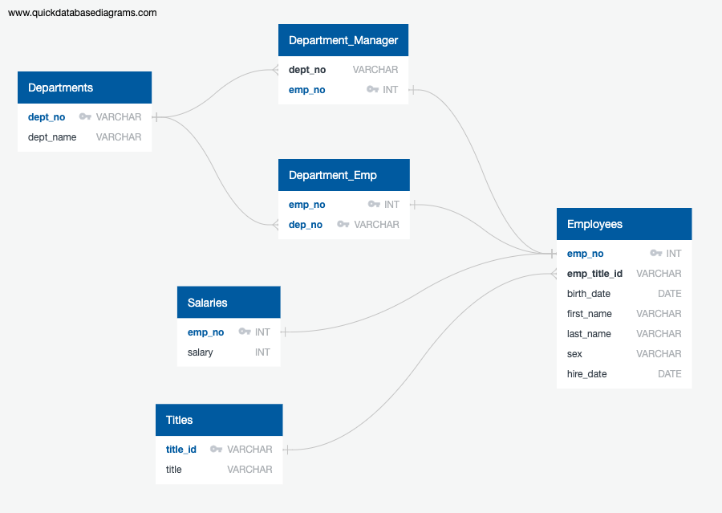

# sql-challenge

## Description
Datasets on employees from the 1980s and 1990s was provided to design tables to hold the data and query them to analyze various employee information.

## How to Run Code
Clone this repository, use the schema sql code to create the tables in your database, then load the employee SQL data into the respective tables, and finally, use the query SQL code to run the queries.

## Results
See below for the entity relationship diagram that structures the tables in the database.

Follow the instructions under the "how to run code" section to view the results of the following questions:

1. List the following details of each employee: employee number, last name, first name, sex, and salary.

2. List first name, last name, and hire date for employees who were hired in 1986.

3. List the manager of each department with the following information: department number, department name, the manager's employee number, last name, first name.

4. List the department of each employee with the following information: employee number, last name, first name, and department name.

5. List first name, last name, and sex for employees whose first name is "Hercules" and last names begin with "B."

6. List all employees in the Sales department, including their employee number, last name, first name, and department name.

7. List all employees in the Sales and Development departments, including their employee number, last name, first name, and department name.

8. In descending order, list the frequency count of employee last names, i.e., how many employees share each last name.